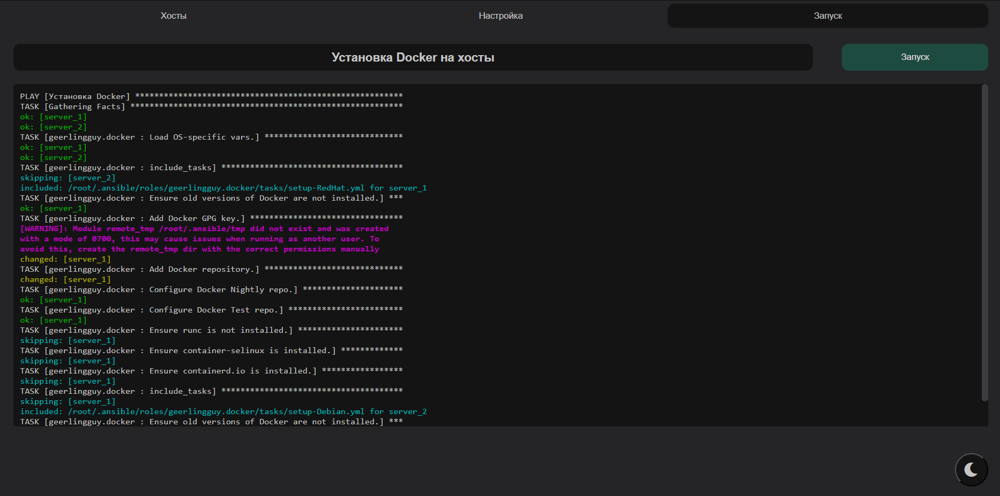

# Admin Helper

         ╔╗       ╔╗ ╔╗  ╔╗
         ║║       ║║ ║║  ║║ 
    ╔══╦═╝╠╗╔╦╦═╗ ║╚═╝╠══╣║╔══╦══╦═╗ 
    ║╔╗║╔╗║╚╝╠╣╔╗╗║╔═╗║║═╣║║╔╗║║═╣╔╝
    ║╔╗║╚╝║║║║║║║║║║ ║║║═╣╚╣╚╝║║═╣║
    ╚╝╚╩══╩╩╩╩╩╝╚╝╚╝ ╚╩══╩═╣╔═╩══╩╝
                           ║║
                           ╚╝

Admin Helper позволяет упростить процесс автоматизации разворачивания основных сервисов на системах Linux на основе Ansible.
Настройка и запуск происходит в веб-интерфейсе.

## Описание

Admin Helper запускается в Docker контейнерах, что делает ПО независимым от среды и быстрым для установки.

Основные составляющие Admin Helper:
1) Контейнер с Ansible, с уже заготовленными плейбуками, а также api сервером (gunicorn + Django)
2) Контейнер с веб-интерфейсом (html, css, JavaScript) для упрощённого взаимодействия с Ansible

Реализованный на данный момент функционал:
1) Разворачивание СУДБ PostgreSQL на хосте
2) Разворачивание СУБД PostgreSQL в docker контейнере
3) Установка pgAgent на хост (пока только Debian-системы)
4) Разворачивание pgAdmin4 в docker контейнере
5) Установка и настройка прокси и балансировщика Haproxy на хост (пока только Debian-системы)
6) Установка и настройка прокси и балансировщика Haproxy в docker контейнере
7) Разворот связки Prometheus + Grafana для мониторинга в docker контейнерах
8) Установка агентов Prometheus Node Exporter на хосты (для сбора метрик) (пока только Debian-системы)
9) Разворот мониторинга Zabbix в docker контейнерах
10) Установка агентов Zabbix Agent на хосты (для сбора метрик)

## Установка

Для запуска Admin Helper необходимы установленные Docker и Docker Compose.

1. Скачать релизный docker-compose.yml файл: `curl -o docker-compose.yml https://raw.githubusercontent.com/some-kind/admin_helper/master/release%20compose%20file/docker-compose.yml`. 
Или `wget -O docker-compose.yml https://raw.githubusercontent.com/some-kind/admin_helper/master/release%20compose%20file/docker-compose.yml`.
Или скачать из данного репозитория напрямую (папка release compose file). Также данный файл поставляется с релизом новой версии (смотрите блок Releases)
2. Запустить приложение: `docker compose up -d` или `docker-compose up -d`
3. В браузере перейти по адресу вашего сервера, например: `http://localhost/`

## Использование

Веб-интерфейс приложения имеет 3 основные вкладки:
### Хосты

Настройка групп хостов, к которым подключается Ansible и выполняет действия по настройке и разворачиванию сервисов

### Настройки

Настройка дополнительных переменных (выбор группы настроек выполнен в виде выпадающего списка сверху)

### Запуск

Выбор задачи для выполнения, её запуск и отслеживание процесса выполнения

## Вклад

Приветствуется: сообщение об ошибках, предложения улучшений, новых функций и т.д.

# История изменений

## [Версия 1.0.0] - 16.05.2024

- Первичный функционал веб-интерфейса и Ansible
- Разворачивание СУБД PostgreSQL на хосте
- Разворачивание СУБД PostgreSQL в docker контейнере
- Установка pgAgent на хост (пока только Debian-системы)
- Разворачивание pgAdmin4 в docker контейнере
- Установка и настройка прокси и балансировщика Haproxy на хост (пока только Debian-системы)
- Установка и настройка прокси и балансировщика Haproxy в docker контейнере
- Разворот связки Prometheus + Grafana для мониторинга в docker контейнерах
- Установка агентов Prometheus Node Exporter на хосты (для сбора метрик) (пока только Debian-системы)
- Разворот мониторинга Zabbix в docker контейнерах
- Установка агентов Zabbix Agent на хосты (для сбора метрик)

## [Патч 1.0.1] - 16.05.2024

- Исправлена ошибка работы кнопки "Удалить" хост (не работала кнопка после добавления нового хоста до перезагрузки страницы)
- Исправлена ошибка, когда при запуске плейбука не подтягивался файл ansible.cfg
- Исправлена ошибка таймаута Gunicorn при выполнении плейбуков 

## [Патч 1.0.2] - 17.05.2024

- Добавлена цветная индикация в логах выполнения плейбуков при запуске
- Добавлена поддержка светлой и тёмной темы (кнопка смены находится внизу страницы)

